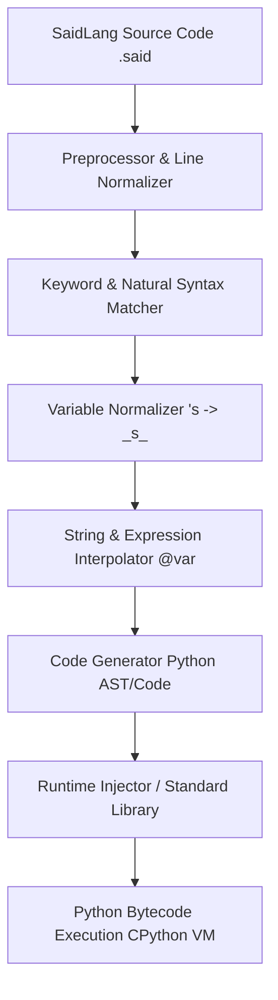

# SaidLang Architecture & Pipeline

This document explains the internal execution model, pipeline phases, and design decisions behind SaidLang.

---

## 🏗️ Transpilation Pipeline

SaidLang transforms high-level, human-friendly English syntax into optimized, idiomatic Python code.

### 1. Preprocessing & Normalization
- Preserves indentation levels for block scoping (Python-like 4-space blocks).
- Strips trailing whitespace and handles single-line comments (`#` or `note:`).

### 2. Matching & Pattern Transformation
- Matches high-level idioms like `save <var> as <val> as <type>`.
- Converts comparison phrases (e.g. `is bigger than`, `is equal to`, `is at least`) into canonical Python comparison operators (`>`, `==`, `>=`).

### 3. String & Variable Interpolation
- Scans for `@identifier` tokens inside strings or unquoted sentences and transforms them into Python f-strings: `f"my name is {name}"`.

### 4. Runtime Integration
- Bundles lightweight, zero-dependency helper functions from `saidlang.runtime` (e.g. `show`, `ask`, `read_file`, `write_file`, `download_webpage`).

---

## 📦 Package Modules

| Module | Purpose |
| :--- | :--- |
| `saidlang.transpiler` | Core transpilation logic and rule matching. |
| `saidlang.runtime` | Standard library built-ins injected into executed programs. |
| `saidlang.cli` | Terminal CLI commands and interactive REPL. |
| `saidlang.hook` | Python `sys.meta_path` import hook for importing `.said` files directly in Python. |
